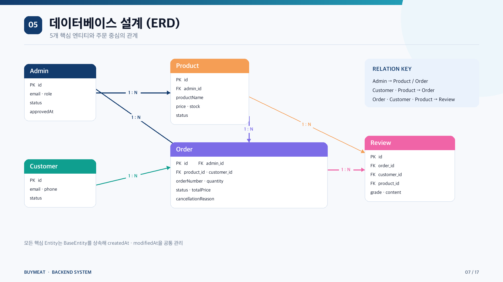
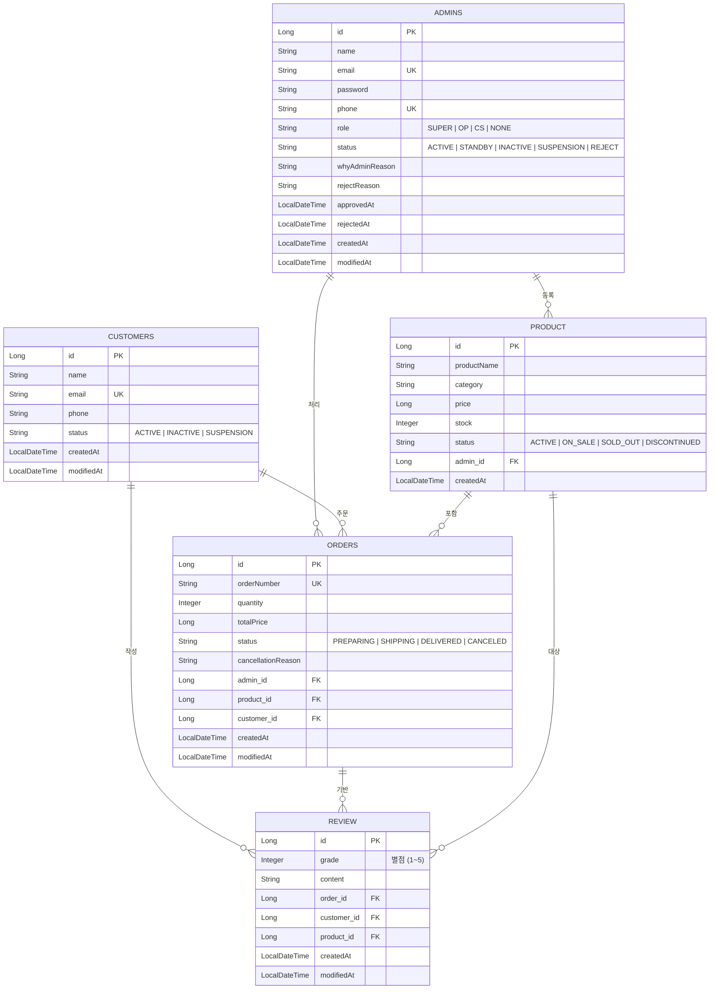
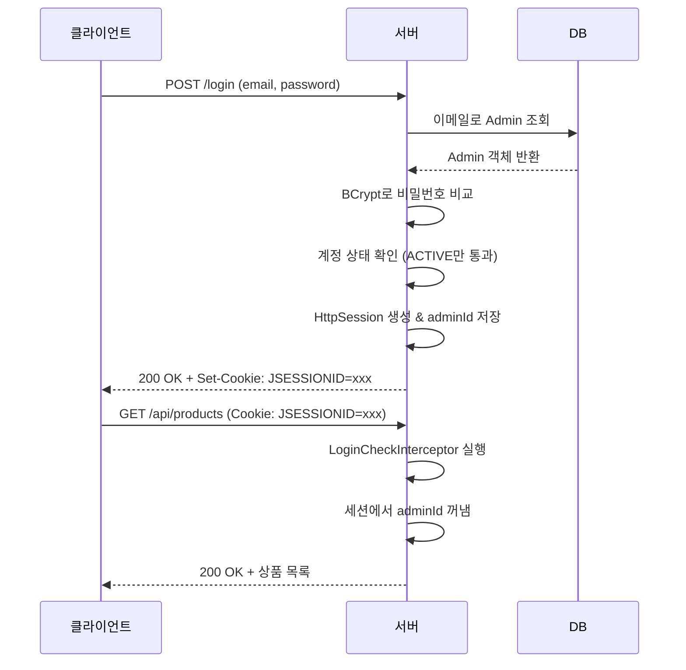
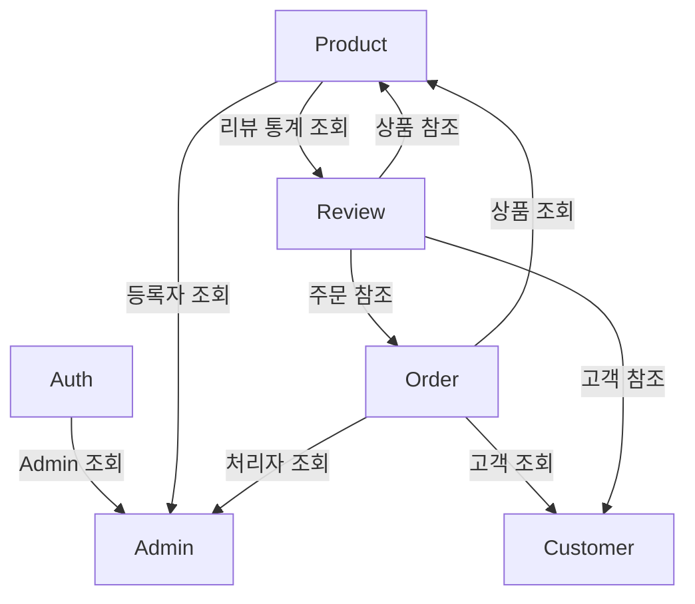

# 🛒 ECommerce System Project - 고기먹고싶조

> Spring Boot와 JPA를 활용한 전자상거래 관리자 시스템

관리자 계정을 통해 상품, 고객, 주문, 리뷰를 효율적으로 관리하고,
대시보드를 통해 서비스 현황을 한눈에 확인할 수 있는 **관리자 전용 백오피스 시스템**입니다.


---

## 📅 프로젝트 기간

2026.07.10 ~ 2026.07.16

---

## 👨‍💻 팀구성 및 역할분담

| 담당자 | 담당 역할 |
|------|------|
| 신원열 | 관리자(Admin), 대시보드(Dashboard), 기능 테스트, 프로젝트 전체관리 |
| 안상윤 | 로그인(Auth), 대시보드(Dashboard), 전역 예외처리, 공통응답 |
| 강충만 | 고객(Customer), 대시보드(Dashboard) |
| 김예림 | 상품(Product), 발표자료준비 |
| 김준희 | 주문(Order), 기능 테스트 |
| 강준모 | 리뷰(Review), 기능 테스트 |

---

## 🛠 기술스택

| 분야 | 기술 |
|------|------|
| ☕ Language | Java 21 |
| 🌱 Framework | Spring Boot |
| 🗄 Database | MySQL |
| 🔗 ORM | Spring Data JPA |
| 🔐 Authentication | Http Session, HandlerInterceptor |
| 📄 API Docs | Swagger (SpringDoc OpenAPI) |
| 🧪 API Test | Postman |
| ⚙ Build Tool | Gradle |
| 💻 IDE | IntelliJ IDEA |
| 🤝 Collaboration | Git, GitHub, Notion, Slack |

---

## 📂 프로젝트 구조

```text
src
 ├── admin
 ├── auth
 ├── customer
 ├── dashboard
 ├── order
 ├── product
 ├── review
 └── common
```

---

## ✨ 주요 기능

### 👤 관리자(Admin)

- 회원가입 및 로그인
- Http Session 기반 인증
- 역할(Role) 기반 권한 관리 (SUPER, OP, CS, NONE)
- 관리자 상태 관리 (ACTIVE, STANDBY, INACTIVE, SUSPENSION, REJECT)
- 관리자 승인 및 상태 변경

---

### 👥 고객(Customer)

- 고객 등록
- 고객 조회 (전체 조회, 상세 조회, 키워드 검색, 상태별 검색, 페이징, 고객 정보 수정)
- 고객 상태 변경
- 고객별 총 주문 수 조회
- 고객별 총 구매 금액 조회
- 고객 상세 조회 시 주문 통계 제공

---

### 📦 상품(Product)

- 상품 등록
- 상품 조회 (전체 조회, 상세 조회, 검색, 카테고리 검색, 상태 검색, 페이징)
- 상품 수정
- 재고 수정
- 상품 상태 변경

### 📊 상품 리뷰 통계

상품 상세 조회 시

- 평균 평점
- 전체 리뷰 수
- 별점별 리뷰 개수
- 최신 리뷰 3건 조회

---

### 🛒 주문(Order)

- 주문 생성
- 주문 조회 (전체 조회, 상세 조회, 검색, 상태 검색, 페이징)
- 주문 상태 변경
- 주문 취소
- 주문번호 자동 생성

### 📦 재고 관리

- 주문 생성 시 재고 검증
- 재고 부족 시 주문 차단
- 부족한 재고 수량 안내
- 주문 완료 시 재고 차감
- 주문 취소 시 재고 복구

---

### ⭐ 리뷰(Review)

- 리뷰 조회 (전체 조회, 상세 조회)
- 고객명 / 상품명 검색
- 평점 필터
- 정렬
- 페이징
- 리뷰 삭제

---

### 📊 관리자 대시보드

### Summary

- 전체 관리자 수, 활성 관리자 수
- 전체 고객 수, 활성 고객 수
- 전체 상품 수, 재고 부족 상품 수
- 전체 주문 수, 오늘 주문 수
- 전체 리뷰 수, 평균 평점

### Widgets

- 총 매출, 오늘 매출
- 준비중 주문 수
- 배송중 주문 수
- 배송완료 주문 수
- 재고 부족 상품 수
- 품절 상품 수

### Charts

- 리뷰 평점 분포
- 고객 상태 분포
- 상품 카테고리 분포

### 최근 주문

- 최근 주문 10건 조회

---

## 🛡 공통 기능

### 인증

- Http Session 기반 로그인
- HandlerInterceptor 인증 처리
- 로그인 사용자 권한 검증

### Validation

- Bean Validation 적용
- 입력값 검증

### Exception

- Global Exception Handler 적용
- 표준화된 에러 응답 제공

### Response

모든 API는 공통 응답 형식을 사용합니다.

```json
{
  "status": 200,
  "message": "성공",
  "data": {}
}
```

---

## 🌳 Git 전략

```
main
└── develop
    ├── feature/admin
    ├── feature/customer
    ├── feature/product
    ├── feature/order
    ├── feature/review
    └── feature/dashboard
```

Feature 브랜치에서 개발 후

```
Feature
   ↓
Pull Request
   ↓
Code Review
   ↓
develop Merge
```

방식으로 협업을 진행했습니다.

---

## 🤝 협업 방식

- Notion 및 Slack을 통한 일정 및 작업 관리
- GitHub Pull Request 기반 코드 리뷰
- 역할 분담 후 기능 개발
- 개발 완료 후 develop 브랜치 병합
- 리소스가 남는 팀원은 다른 기능 구현 및 테스트 지원

---

## 📌 구현 범위

### ✅ 기본 기능

- 관리자, 고객, 상품, 주문, 리뷰

### ✅ 도전 과제 Level 1

- 검색
- 페이징
- 권한 관리

### ✅ 도전 과제 Level 2

- 상품별 리뷰조회
- Dashboard Summary
- Dashboard Charts
- 최근 주문 조회
- 통계 데이터 제공

---

## 🗂 ERD

프로젝트의 데이터베이스 구조입니다.

<p align="center">
  
</p>

---

# 📑 API 명세

API는 Swagger(OpenAPI)를 통해 확인할 수 있습니다.

### Swagger

```
http://localhost:8080/swagger-ui/index.html
```

---

## API 목록

### 🔐 Auth

| Method | URL | 설명 |
|---------|-----|------|
| POST | /api/signup | 관리자 회원가입 |
| POST | /api/login | 로그인 |
| POST | /api/logout | 로그아웃 |

---

### 👤 Admin

| Method | URL | 설명 |
|---------|-----|------|
| GET | /api/admins | 관리자 조회 |
| GET | /api/admins/{adminId} | 관리자 상세 조회 |
| PATCH | /api/admins/{adminId} | 관리자 정보 변경 |
| PATCH | /api/admins/{adminId}/approve | "승인대기" 상태를 승인 |
| PATCH | /api/admins/{adminId}/dismiss | "승인대기" 상태를 거부 |
| PATCH | /api/admins/{adminId}/role | 관리자 역할 변경 |
| PATCH | /api/admins/password | 비밀번호 변경 |
| PATCH | /api/admins/profile | 프로필 변경 |

---

### 👥 Customer

| Method | URL | 설명 |
|---------|-----|------|
| POST | /api/customers | 고객 등록 |
| GET | /api/customers | 고객 목록 조회 |
| GET | /api/customers/{customerId} | 고객 상세 조회 |
| PUT | /api/customers/{customerId} | 고객 수정 |
| PATCH | /api/customers/{customerId}/status | 고객 상태 변경 |
| DELETE | /api/customers/{customerId} | 고객 삭제 |

---

### 📦 Product

| Method | URL | 설명 |
|---------|-----|------|
| POST | /api/products | 상품 등록 |
| GET | /api/products | 상품 목록 조회 |
| GET | /api/products/{productId} | 상품 상세 조회 |
| PUT | /api/products/{productId} | 상품 수정 |
| PATCH | /api/products/{productId}/stock | 재고 수정 |
| PATCH | /api/products/{productId}/status | 상품 상태 변경 |
| DELETE | /api/products/{productId} | 상품 삭제 |

---

### 🛒 Order

| Method | URL | 설명 |
|---------|-----|------|
| POST | /api/orders | 주문 생성 |
| GET | /api/orders | 주문 목록 조회 |
| GET | /api/orders/{orderId} | 주문 상세 조회 |
| PATCH | /api/orders/{orderId}/status | 주문 상태 변경 |
| PATCH | /api/orders/{orderId}/cancel | 주문 취소 |

---

### ⭐ Review

| Method | URL | 설명 |
|---------|-----|------|
| GET | /api/reviews | 리뷰 목록 조회 |
| GET | /api/reviews/{reviewId} | 리뷰 상세 조회 |
| POST | /api/reviews/{reviewId} | 리뷰 생성 |
| PUT | /api/reviews/{reviewId} | 리뷰 수정 |
| DELETE | /api/reviews/{reviewId} | 리뷰 삭제 |

---

### 📊 Dashboard

| Method | URL | 설명 |
|---------|-----|------|
| GET | /api/dashboard | Summary 통계, Widgets 데이터, Charts 데이터, 최근 주문 목록 |


---

# 🧪 테스트

프로젝트 API는 Swagger를 활용하여 테스트를 진행했습니다.

- Swagger UI를 통한 API 테스트
- Session 기반 로그인 인증 테스트
- 권한(Role)별 접근 테스트
- Validation 및 Exception 테스트

---

# 내부 구조
## 다이어그램

### ERD



### 세션 기반 인증 흐름



### 도메인 간 의존 관계



## 🚀 실행 방법

```bash
git clone https://github.com/wonyeol-shin/buymeat.git
```

```bash
cd ecommercesystemproject
```

```bash
./gradlew bootRun
```

---

## 💬 프로젝트를 통해 배운 점

- Spring Boot 계층형 아키텍처 설계
- JPA 연관관계 및 JPQL 활용
- 세션 기반 인증 구현
- 공통 응답 및 예외 처리 설계
- Git Flow 및 Pull Request 기반 협업 경험
- Dashboard 통계 기능 구현

# Contributors

<a href="https://github.com/wonyeol-shin"></a>&nbsp;&nbsp;&nbsp;&nbsp;
<a href="https://github.com/Junyho"></a>&nbsp;&nbsp;&nbsp;&nbsp;
<a href="https://github.com/chungmani"></a>&nbsp;&nbsp;&nbsp;&nbsp;
<a href="https://github.com/OdinAhn"></a>&nbsp;&nbsp;&nbsp;&nbsp;
<a href="https://github.com/yeang976-art"></a>&nbsp;&nbsp;&nbsp;&nbsp;
<a href="https://github.com/spartamo1"></a>
